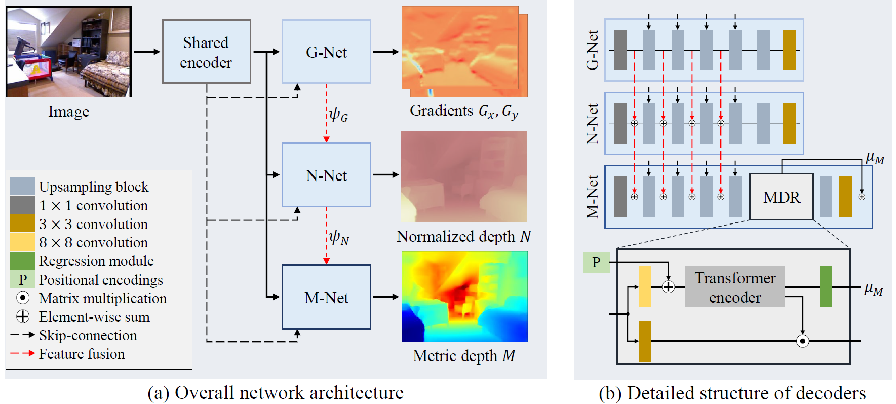

# (ECCV 2022) Depth Map Decomposition for Monocular Depth Estimation
### Jinyoung Jun, Jae-Han Lee, Chul Lee, and Chang-Su Kim

Official pytorch implementation for **"Depth Map Decomposition for Monocular Depth Estimation"** [[arxiv]](https://arxiv.org/abs/2208.10762).

<p float="left">
  &emsp;&emsp; 
</p>

### Instruction

1. For evaluation on NYUv2, download and follow the instructions in the "Prepare NYU Depth V2 test set" section from (https://github.com/cleinc/bts).

2. Move ``nyu_depth_v2`` folder to ```root/``` and download our [model parameters](https://drive.google.com/drive/folders/1zsgT_5AO89WxzlFI53gwjomisb_Gkcox?usp=sharing) to ```root/```.
Models with 'HRWSI' mean that the model is trained with both NYUv2 and [HR-WSI](https://github.com/KexianHust/Structure-Guided-Ranking-Loss) datasets.

3. Run with
```
cd root
python evaluation.py --ckpt $model_path$
```

### Reference
```
@article{jun2022depth,
  title={Depth Map Decomposition for Monocular Depth Estimation},
  author={Jun, Jinyoung and Lee, Jae-Han and Lee, Chul and Kim, Chang-Su},
  journal={arXiv preprint arXiv:2208.10762},
  year={2022}
}
```
